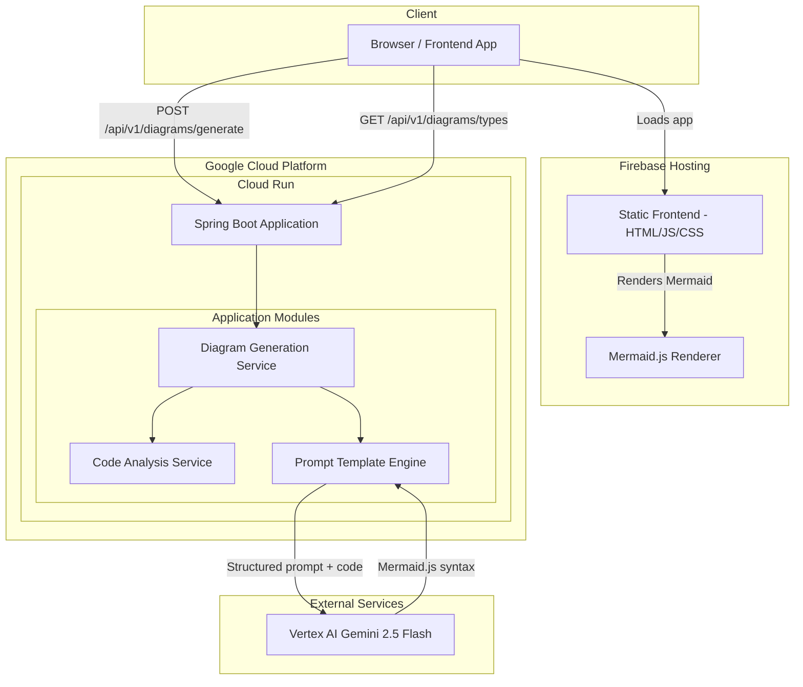

# Architecture -- Diagram-as-Code Architect

## High-Level Service Architecture



### Flow Summary

There is one primary data flow:

**Diagram Generation Flow:**
1. User pastes source code into the frontend and selects a diagram type.
2. The frontend sends the code and diagram type to the `POST /api/v1/diagrams/generate` endpoint.
3. The Code Analysis Service preprocesses the input, identifying the code language (Java or HCL) and validating it is non-empty.
4. The Prompt Template Engine selects the appropriate prompt template for the requested diagram type and code language, then assembles the full prompt with the code embedded as context.
5. The prompt is sent to Vertex AI Gemini 2.5 Flash via Spring AI's ChatClient.
6. The LLM response is parsed to extract the Mermaid.js syntax block.
7. The backend returns the Mermaid syntax and metadata to the frontend.
8. The frontend renders the Mermaid.js diagram in the browser using the Mermaid.js library.
9. The user can copy the raw Mermaid syntax, edit it in-place, or export the diagram as PNG or SVG.

---

## Tech Stack

| Service / Concern | Technology | Version | Rationale |
|---|---|---|---|
| Runtime | Java | 21 (LTS) | Long-term support, modern language features (records, text blocks for prompt templates) |
| Framework | Spring Boot | 3.4.5 | Stable release compatible with Spring AI 1.0.x; mature ecosystem |
| AI Framework | Spring AI | 1.0.1 | GA release with built-in Vertex AI Gemini ChatClient and structured output support |
| Build Tool | Gradle (Kotlin DSL) | 8.x | Convention-over-configuration, strong Spring Boot plugin support |
| Chat Model | Vertex AI Gemini 2.5 Flash | -- | Fast, cost-effective generative model with strong code understanding; ideal for structured output tasks |
| Frontend Framework | Vanilla HTML/CSS/JS | -- | Minimal complexity; no build step needed for a single-page rendering tool |
| Diagram Rendering | Mermaid.js | 11.6.0 | Industry-standard diagram-as-code library; renders directly in the browser |
| Frontend Hosting | Firebase Hosting | -- | Fast CDN-backed static hosting; already configured in the GCP project |
| Containerization | Docker (Jib) | -- | Jib builds optimized container images without a Dockerfile |
| Deployment | Google Cloud Run | v2 | Serverless container hosting; scales to zero; IAM-integrated |

---

## Key Design Decisions and Trade-offs

### 1. Gemini 2.5 Flash vs. Gemini 2.5 Pro for Code Analysis

**Decision:** Use Gemini 2.5 Flash.

**Rationale:**
- Gemini 2.5 Flash offers strong code understanding at significantly lower latency and cost than Pro.
- Diagram generation from code is a structured extraction task, not a deep reasoning task, making Flash's capabilities sufficient.
- The lower latency provides a better user experience for an interactive tool.

**Trade-off:** For extremely large or complex codebases, Pro might produce slightly better structural analysis. The input size limit and prompt design mitigate this.

### 2. Stateless Backend (No Database)

**Decision:** The backend is fully stateless with no database. Diagrams are generated on-the-fly and returned in the API response.

**Rationale:**
- Eliminates infrastructure complexity (no Cloud SQL, no schema migrations).
- Keeps the project scope at Low-Medium effort.
- Users can save diagrams by copying the Mermaid syntax or exporting images.
- If diagram history is needed in the future, it can be added as an enhancement.

**Trade-off:** No server-side history or saved diagrams. Acceptable for a developer productivity tool where output is typically copy-pasted into documentation.

### 3. Prompt Engineering for Valid Mermaid Syntax

**Decision:** Use carefully designed prompt templates that include Mermaid syntax rules, examples of valid output, and explicit instructions for the LLM to produce only the Mermaid code block.

**Rationale:**
- LLMs can produce syntactically invalid Mermaid if not guided carefully (e.g., using reserved characters in node labels, incorrect arrow syntax).
- Including a few-shot example of valid Mermaid output in each prompt template dramatically improves output quality.
- Spring AI's structured output support helps extract clean Mermaid blocks from LLM responses.

**Trade-off:** Prompt templates are tightly coupled to Mermaid syntax versions. If Mermaid.js introduces breaking syntax changes, prompts must be updated.

### 4. Supported Input Types

**Decision:** Support two input types at launch: Spring Boot Java source code and Terraform HCL files.

**Rationale:**
- These are the two most common artifact types in a cloud-native engineering workflow.
- Java and HCL have very different structures, demonstrating the system's flexibility.
- Additional languages (Python, Go, Kubernetes YAML) can be added by creating new prompt templates without changing the core architecture.

### 5. Supported Diagram Types

**Decision:** Support these Mermaid diagram types:

| Diagram Type | Code Language | Description |
|---|---|---|
| `FLOWCHART` | Java, HCL | Component/architecture overview showing services and their connections |
| `SEQUENCE` | Java | Request flow through Spring Boot controllers, services, and repositories |
| `CLASS` | Java | Class hierarchy and relationships (extends, implements, uses) |
| `ENTITY_RELATIONSHIP` | Java | JPA entity relationships derived from annotations |
| `INFRASTRUCTURE` | HCL | Cloud infrastructure topology from Terraform resources |

### 6. Frontend on Firebase Hosting vs. Embedded in Spring Boot

**Decision:** Host the frontend separately on Firebase Hosting as a static site.

**Rationale:**
- Decouples frontend deployment from backend; frontend updates do not require a Cloud Run redeployment.
- Firebase Hosting provides CDN-backed distribution with zero configuration.
- Static files served from a CDN are faster than serving from Cloud Run.
- Demonstrates a modern decoupled architecture pattern.

**Trade-off:** Requires CORS configuration on the backend. A simple CORS filter in Spring Boot handles this.

---

## Project Source Code Structure

```
diagram-as-code-architect/
|-- backend/
|   |-- build.gradle.kts
|   |-- settings.gradle.kts
|   |-- src/
|   |   |-- main/
|   |   |   |-- java/com/jkingai/diagramarchitect/
|   |   |   |   |-- DiagramArchitectApplication.java          # Spring Boot entry point
|   |   |   |   |-- config/
|   |   |   |   |   |-- AiConfig.java                         # Spring AI ChatClient bean configuration
|   |   |   |   |   |-- CorsConfig.java                       # CORS configuration for Firebase frontend
|   |   |   |   |-- controller/
|   |   |   |   |   |-- DiagramController.java                # REST endpoints for diagram generation
|   |   |   |   |   |-- HealthController.java                 # Health check endpoint
|   |   |   |   |-- service/
|   |   |   |   |   |-- DiagramGenerationService.java         # Orchestrates code analysis and diagram generation
|   |   |   |   |   |-- CodeAnalysisService.java              # Validates and preprocesses code input
|   |   |   |   |   |-- PromptTemplateEngine.java             # Selects and assembles prompt templates
|   |   |   |   |   |-- MermaidSyntaxExtractor.java           # Extracts and validates Mermaid blocks from LLM response
|   |   |   |   |-- model/
|   |   |   |   |   |-- DiagramType.java                      # Enum: FLOWCHART, SEQUENCE, CLASS, ENTITY_RELATIONSHIP, INFRASTRUCTURE
|   |   |   |   |   |-- CodeLanguage.java                     # Enum: JAVA, HCL
|   |   |   |   |-- dto/
|   |   |   |   |   |-- DiagramRequest.java                   # Request DTO for diagram generation
|   |   |   |   |   |-- DiagramResponse.java                  # Response DTO with Mermaid syntax
|   |   |   |   |   |-- DiagramTypeInfo.java                  # DTO for listing supported diagram types
|   |   |   |   |   |-- ErrorResponse.java                    # Standard error response DTO
|   |   |   |   |-- exception/
|   |   |   |   |   |-- GlobalExceptionHandler.java           # @ControllerAdvice for consistent error responses
|   |   |   |   |   |-- DiagramGenerationException.java       # Generation failures
|   |   |   |   |   |-- UnsupportedDiagramTypeException.java  # Invalid diagram type for code language
|   |   |   |   |-- prompt/
|   |   |   |       |-- templates/
|   |   |   |           |-- java-flowchart.txt                # Prompt template for Java flowchart diagrams
|   |   |   |           |-- java-sequence.txt                 # Prompt template for Java sequence diagrams
|   |   |   |           |-- java-class.txt                    # Prompt template for Java class diagrams
|   |   |   |           |-- java-entity-relationship.txt      # Prompt template for Java ER diagrams
|   |   |   |           |-- hcl-flowchart.txt                 # Prompt template for Terraform flowchart diagrams
|   |   |   |           |-- hcl-infrastructure.txt            # Prompt template for Terraform infrastructure diagrams
|   |   |   |-- resources/
|   |   |       |-- application.yml                           # Main configuration
|   |   |       |-- application-local.yml                     # Local dev overrides
|   |   |       |-- application-prod.yml                      # Production (Cloud Run) overrides
|   |   |-- test/
|   |       |-- java/com/jkingai/diagramarchitect/
|   |           |-- service/
|   |           |   |-- DiagramGenerationServiceTest.java
|   |           |   |-- CodeAnalysisServiceTest.java
|   |           |   |-- PromptTemplateEngineTest.java
|   |           |   |-- MermaidSyntaxExtractorTest.java
|   |           |-- controller/
|   |           |   |-- DiagramControllerTest.java
|   |           |-- integration/
|   |               |-- DiagramGenerationIntegrationTest.java  # End-to-end test with mocked LLM
|   |           |-- resources/
|   |               |-- sample-spring-boot-code.java           # Sample input for tests
|   |               |-- sample-terraform.tf                    # Sample input for tests
|   |               |-- expected-flowchart.mmd                 # Expected output for validation
|-- frontend/
|   |-- index.html                                            # Main HTML page
|   |-- css/
|   |   |-- style.css                                         # Application styles (dark theme)
|   |-- js/
|   |   |-- app.js                                            # Main application logic
|   |   |-- api.js                                            # API client for backend calls
|   |   |-- renderer.js                                       # Mermaid.js initialization and rendering
|   |   |-- exporter.js                                       # PNG/SVG export functionality
|   |-- firebase.json                                         # Firebase Hosting configuration
|   |-- .firebaserc                                           # Firebase project alias
```
