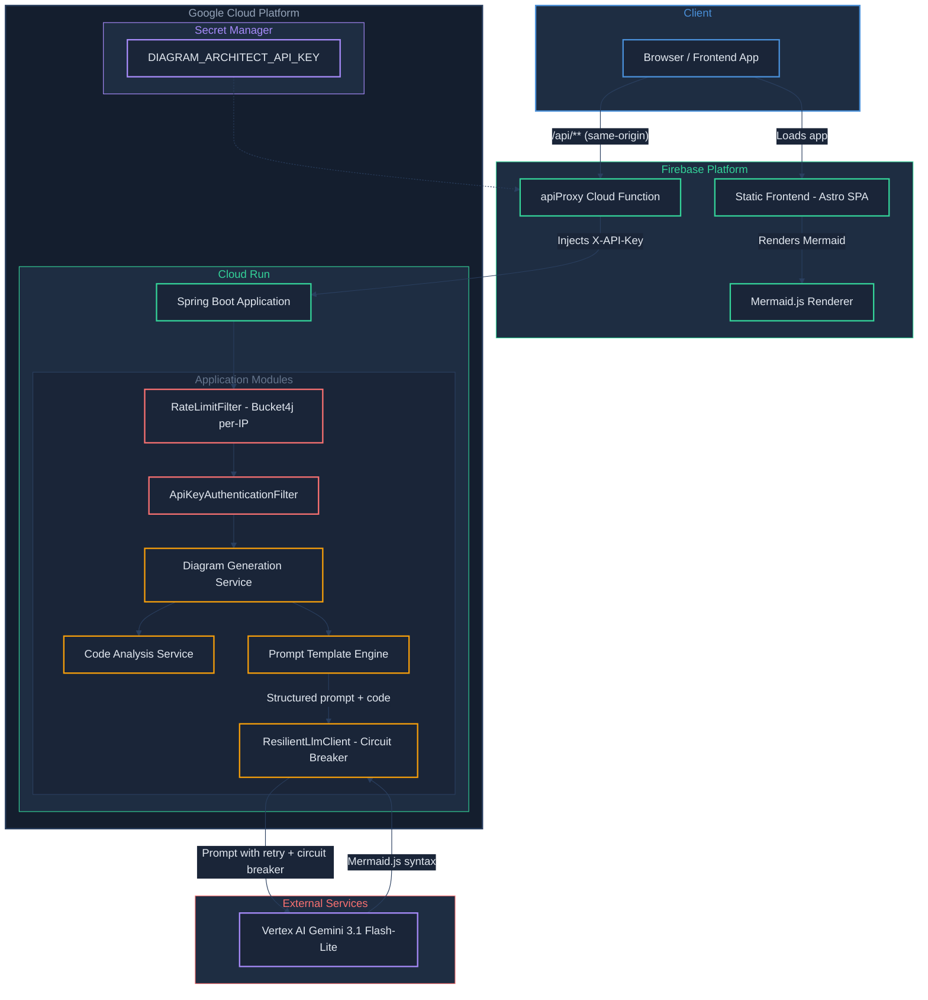

# Architecture -- Diagram-as-Code Architect

## High-Level Service Architecture



### Flow Summary

There is one primary data flow:

**Diagram Generation Flow (Production):**
1. User pastes source code into the frontend and selects a diagram type.
2. The frontend sends a same-origin request to `/api/**`, which Firebase Hosting rewrites to the `apiProxy` Cloud Function.
3. The Cloud Function injects the `X-API-Key` header (read from GCP Secret Manager) and proxies the request to the Cloud Run backend.
4. The `RateLimitFilter` (Bucket4j, per-IP) throttles the request first; if the bucket is exhausted it short-circuits with `429 RATE_LIMIT_EXCEEDED` before any auth or downstream work runs. The `ApiKeyAuthenticationFilter` then validates the API key.
5. The Code Analysis Service preprocesses the input, validating the code language and diagram type combination.
6. The Prompt Template Engine selects the appropriate prompt template and assembles the full prompt with the code embedded as context.
7. The prompt is sent to Vertex AI Gemini 3.1 Flash-Lite via `ResilientLlmClient`, which wraps Spring AI's `ChatClient` with a Resilience4j circuit breaker and retry logic.
8. The LLM response is parsed to extract the Mermaid.js syntax block.
9. The backend returns the Mermaid syntax and metadata to the frontend.
10. The frontend renders the Mermaid.js diagram in the browser using the Mermaid.js library.
11. The user can copy the raw Mermaid syntax, edit it in-place, or export the diagram as PNG or SVG.

**Diagram Generation Flow (Local Dev):**
1. Frontend on `:4321` sends requests directly to backend on `:8080` with `X-API-Key: dev-local-key-changeme`.
2. Steps 4-11 above apply.

---

## Tech Stack

| Service / Concern | Technology | Version | Rationale |
|---|---|---|---|
| Runtime | Java | 21 (LTS) | Long-term support, modern language features (records, text blocks for prompt templates) |
| Framework | Spring Boot | 3.5.11 | Stable release compatible with Spring AI 1.1.x; mature ecosystem |
| AI Framework | Spring AI | 1.1.2 (`spring-ai-starter-model-vertex-ai-gemini`) | GA release with built-in Vertex AI Gemini ChatClient and structured output support |
| Build Tool | Gradle (Kotlin DSL) | 8.x | Convention-over-configuration, strong Spring Boot plugin support |
| Chat Model | Vertex AI Gemini 3.1 Flash-Lite | preview | Fast, cost-effective generative model with strong code understanding; ideal for structured output tasks |
| Resilience | Resilience4j | 2.2.0 | Circuit breaker and retry for LLM calls; prevents cascading failures from rate limits |
| Frontend Framework | Astro | 5.17.1 | Lightweight static-site generator; single-page app with inline scripts and CDN-loaded Mermaid.js |
| Diagram Rendering | Mermaid.js | 11.6.0 (CDN) | Industry-standard diagram-as-code library; renders directly in the browser |
| Frontend Hosting | Firebase Hosting | -- | Fast CDN-backed static hosting; already configured in the GCP project |
| Containerization | Jib (Gradle plugin) | 3.4.5 | Builds optimized container images without a Dockerfile; base image `eclipse-temurin:21-jre` |
| Deployment | Google Cloud Run | v2 | Serverless container hosting; scales to zero; IAM-integrated |

---

## Key Design Decisions and Trade-offs

### 1. Gemini 3.1 Flash-Lite vs. Gemini 3.1 Pro for Code Analysis

**Decision:** Use Gemini 3.1 Flash-Lite (preview).

**Rationale:**
- Flash-Lite offers strong code understanding at significantly lower latency and cost than Pro.
- Diagram generation from code is a structured extraction task, not a deep reasoning task, making Flash-Lite's capabilities sufficient.
- The lower latency provides a better user experience for an interactive tool.

**Trade-off:** For extremely large or complex codebases, Pro might produce slightly better structural analysis. The input size limit and prompt design mitigate this. Flash-Lite is a preview model — pin a stable release once one is GA.

### 2. Retry and Circuit Breaker for LLM Calls

**Decision:** Wrap ChatClient calls with Resilience4j circuit breaker and Spring Retry with exponential backoff.

**Rationale:**
- Vertex AI Gemini can return gRPC `RESOURCE_EXHAUSTED` (429) errors under load.
- A `RetryTemplate` with exponential backoff (3 attempts, 2s initial, 3x multiplier) handles transient rate limits.
- A Resilience4j circuit breaker (`ResilientLlmClient`) opens after repeated failures, failing fast instead of queuing requests to an unhealthy service.
- Differentiated exception types (`LlmRateLimitException`, `LlmServiceUnavailableException`) allow the frontend to show appropriate retry messaging.

**Trade-off:** Adds complexity to the LLM call path. Acceptable because rate-limit errors were observed in production and caused poor user experience without retry logic.

### 3. Stateless Backend (No Database)

**Decision:** The backend is fully stateless with no database. Diagrams are generated on-the-fly and returned in the API response.

**Rationale:**
- Eliminates infrastructure complexity (no Cloud SQL, no schema migrations).
- Keeps the project scope at Low-Medium effort.
- Users can save diagrams by copying the Mermaid syntax or exporting images.
- If diagram history is needed in the future, it can be added as an enhancement.

**Trade-off:** No server-side history or saved diagrams. Acceptable for a developer productivity tool where output is typically copy-pasted into documentation.

### 4. Prompt Engineering for Valid Mermaid Syntax

**Decision:** Use carefully designed prompt templates that include Mermaid syntax rules, examples of valid output, and explicit instructions for the LLM to produce only the Mermaid code block.

**Rationale:**
- LLMs can produce syntactically invalid Mermaid if not guided carefully (e.g., using reserved characters in node labels, incorrect arrow syntax).
- Including a few-shot example of valid Mermaid output in each prompt template dramatically improves output quality.
- Spring AI's structured output support helps extract clean Mermaid blocks from LLM responses.

**Trade-off:** Prompt templates are tightly coupled to Mermaid syntax versions. If Mermaid.js introduces breaking syntax changes, prompts must be updated.

### 5. Supported Input Types

**Decision:** Support two input types at launch: Spring Boot Java source code and Terraform HCL files.

**Rationale:**
- These are the two most common artifact types in a cloud-native engineering workflow.
- Java and HCL have very different structures, demonstrating the system's flexibility.
- Additional languages (Python, Go, Kubernetes YAML) can be added by creating new prompt templates without changing the core architecture.

### 6. Supported Diagram Types

**Decision:** Support these Mermaid diagram types:

| Diagram Type | Code Language | Description |
|---|---|---|
| `FLOWCHART` | Java, HCL | Component/architecture overview showing services and their connections |
| `SEQUENCE` | Java | Request flow through Spring Boot controllers, services, and repositories |
| `CLASS` | Java | Class hierarchy and relationships (extends, implements, uses) |
| `ENTITY_RELATIONSHIP` | Java | JPA entity relationships derived from annotations |
| `INFRASTRUCTURE` | HCL | Cloud infrastructure topology from Terraform resources |

### 7. Frontend on Firebase Hosting vs. Embedded in Spring Boot

**Decision:** Host the frontend separately on Firebase Hosting as a static site.

**Rationale:**
- Decouples frontend deployment from backend; frontend updates do not require a Cloud Run redeployment.
- Firebase Hosting provides CDN-backed distribution with zero configuration.
- Static files served from a CDN are faster than serving from Cloud Run.
- Demonstrates a modern decoupled architecture pattern.

**Trade-off:** Requires CORS configuration on the backend. A simple CORS filter in Spring Boot handles this.

### 8. API Key Authentication with Firebase Function Proxy

**Decision:** Protect the backend API with an `X-API-Key` header validated by a Spring Security filter. Use a Firebase Cloud Function as a reverse proxy that injects the key server-side for production traffic.

**Rationale:**
- The API key prevents unauthorized access to the Vertex AI-backed endpoints, which incur cost per request.
- Injecting the key server-side via a Cloud Function means the frontend never stores or transmits the secret -- it makes same-origin calls to `/api/**`, which Firebase Hosting rewrites to the function.
- The Cloud Function reads the key from GCP Secret Manager (`defineSecret`), so the secret is managed centrally and rotatable without redeploying.
- For local development, a hardcoded dev key (`dev-local-key-changeme`) in `application-local.yml` avoids the need for Secret Manager access.

**Trade-off:** Adds a network hop (Firebase Function → Cloud Run) to every API request in production, adding ~50-100ms latency. Acceptable because diagram generation itself takes 1-3 seconds, so the overhead is negligible relative to LLM processing time.

### 9. Per-IP Rate Limiting with Bucket4j

**Decision:** Throttle requests per client IP using an in-memory Bucket4j-backed `RateLimitFilter`, ordered before the API key filter in the Spring Security chain.

**Rationale:**
- Cloud Run is configured with `allUsers` invoker, so without app-level throttling a single noisy client can saturate the Vertex AI quota for everyone.
- Two buckets per IP: a general bucket (default 10 burst / 60 per minute) for all endpoints and a stricter "generate" bucket (default 5 burst / 30 per minute) for `POST /api/v1/diagrams/generate`, which is the LLM-backed cost driver.
- IP is resolved from `X-Forwarded-For` (Cloud Run sets it) with `request.getRemoteAddr()` as fallback.
- The filter runs *before* `ApiKeyAuthenticationFilter` so unauthenticated traffic is throttled too — attackers can't burn cheap auth checks.
- Limits are tunable via `app.rate-limit.*` in `application.yml`; setting `app.rate-limit.enabled=false` disables the filter entirely (useful for tests).

**Trade-off:** State is in-memory per Cloud Run instance, so limits are not shared across container replicas. Acceptable for current traffic; a Redis-backed bucket store would be the next step if horizontal scaling makes per-instance limits ineffective.

---

## Project Source Code Structure

```
diagram-as-code-architect/
|-- backend/
|   |-- build.gradle.kts
|   |-- settings.gradle.kts
|   |-- bruno/                                                # Bruno API test collection
|   |   |-- bruno.json
|   |   |-- collection.bru
|   |   |-- diagrams/                                         # Diagram endpoint test requests
|   |   |-- environments/                                     # Local and production environments
|   |   |-- health/                                           # Health check test requests
|   |-- src/
|   |   |-- main/
|   |   |   |-- java/com/jkingai/diagramarchitect/
|   |   |   |   |-- DiagramArchitectApplication.java          # Spring Boot entry point
|   |   |   |   |-- config/
|   |   |   |   |   |-- AiConfig.java                         # ChatClient, RetryTemplate, rate-limit detection
|   |   |   |   |   |-- ApiKeyAuthenticationFilter.java       # Validates X-API-Key header
|   |   |   |   |   |-- ApiSecurityProperties.java            # `app.security.*` config binding
|   |   |   |   |   |-- RateLimitFilter.java                  # Bucket4j per-IP throttling (general + generate buckets)
|   |   |   |   |   |-- RateLimitProperties.java              # `app.rate-limit.*` config binding
|   |   |   |   |   |-- SecurityConfig.java                   # Spring Security: CORS + rate-limit + API key filter
|   |   |   |   |-- controller/
|   |   |   |   |   |-- DiagramController.java                # REST endpoints for diagram generation
|   |   |   |   |   |-- GlobalExceptionHandler.java           # @ControllerAdvice for consistent error responses
|   |   |   |   |   |-- HealthController.java                 # Health check endpoint
|   |   |   |   |-- service/
|   |   |   |   |   |-- DiagramGenerationService.java         # Orchestrates code analysis and diagram generation
|   |   |   |   |   |-- CodeAnalysisService.java              # Validates and preprocesses code input
|   |   |   |   |   |-- PromptTemplateEngine.java             # Selects and assembles prompt templates
|   |   |   |   |   |-- MermaidSyntaxExtractor.java           # Extracts and validates Mermaid blocks from LLM response
|   |   |   |   |   |-- ResilientLlmClient.java               # Circuit breaker wrapper around ChatClient
|   |   |   |   |-- model/
|   |   |   |   |   |-- DiagramType.java                      # Enum: FLOWCHART, SEQUENCE, CLASS, ENTITY_RELATIONSHIP, INFRASTRUCTURE
|   |   |   |   |   |-- CodeLanguage.java                     # Enum: JAVA, HCL
|   |   |   |   |-- dto/
|   |   |   |   |   |-- DiagramRequest.java                   # Request DTO for diagram generation
|   |   |   |   |   |-- DiagramResponse.java                  # Response DTO with Mermaid syntax
|   |   |   |   |   |-- DiagramTypeInfo.java                  # DTO for listing supported diagram types
|   |   |   |   |   |-- ErrorResponse.java                    # Standard error response DTO
|   |   |   |   |-- exception/
|   |   |   |   |   |-- DiagramGenerationException.java       # Generation failures
|   |   |   |   |   |-- LlmRateLimitException.java            # 429 rate-limit errors from Vertex AI
|   |   |   |   |   |-- LlmServiceUnavailableException.java   # 503 circuit breaker open
|   |   |   |   |   |-- UnsupportedDiagramTypeException.java  # Invalid diagram type for code language
|   |   |   |   |-- prompt/
|   |   |   |       |-- templates/
|   |   |   |           |-- java-flowchart.txt                # Prompt template for Java flowchart diagrams
|   |   |   |           |-- java-sequence.txt                 # Prompt template for Java sequence diagrams
|   |   |   |           |-- java-class.txt                    # Prompt template for Java class diagrams
|   |   |   |           |-- java-entity-relationship.txt      # Prompt template for Java ER diagrams
|   |   |   |           |-- hcl-flowchart.txt                 # Prompt template for Terraform flowchart diagrams
|   |   |   |           |-- hcl-infrastructure.txt            # Prompt template for Terraform infrastructure diagrams
|   |   |   |-- resources/
|   |   |       |-- application.yml                           # Main config (includes resilience4j circuit breaker)
|   |   |       |-- application-local.yml                     # Local dev overrides (dev API key)
|   |   |       |-- application-prod.yml                      # Production (Cloud Run) overrides
|   |   |-- test/
|   |       |-- java/com/jkingai/diagramarchitect/
|   |           |-- DiagramArchitectApplicationTests.java      # Application context loads
|   |           |-- service/
|   |           |   |-- DiagramGenerationServiceTest.java
|   |           |   |-- CodeAnalysisServiceTest.java
|   |           |   |-- PromptTemplateEngineTest.java
|   |           |   |-- MermaidSyntaxExtractorTest.java
|   |           |-- controller/
|   |           |   |-- DiagramControllerTest.java
|   |           |   |-- DiagramGenerationIntegrationTest.java  # End-to-end test with mocked LLM
|   |           |-- resources/
|   |               |-- sample-spring-boot-code.java           # Sample input for tests
|   |               |-- sample-terraform.tf                    # Sample input for tests
|   |               |-- expected-flowchart.mmd                 # Expected output for validation
|-- frontend/
|   |-- astro.config.mjs                                      # Astro configuration
|   |-- package.json
|   |-- src/
|   |   |-- pages/
|   |       |-- index.astro                                   # Single-page app (UI, API calls, Mermaid rendering, export)
|-- functions/                                                # Firebase Cloud Function (API proxy)
|   |-- src/
|   |   |-- index.ts                                          # apiProxy function: injects X-API-Key, proxies to Cloud Run
|   |-- package.json
|   |-- tsconfig.json
|-- demo/
|   |-- demo.sh                                               # End-to-end demo script (curl + jq)
|   |-- sample-order-service.java                             # Sample Spring Boot code for demo
|   |-- sample-infrastructure.tf                              # Sample Terraform code for demo
|-- docs/
|   |-- README.md                                             # Project overview and quick links
|   |-- architecture.md                                       # System architecture and design decisions
|   |-- api-contracts.md                                      # API endpoint specifications
|   |-- milestones.md                                         # Development phases and deliverables
|   |-- production-deployment.md                              # GCP deployment guide
|   |-- local-dev-guide.md                                    # Local development setup
|   |-- local-testing-guide.md                                # Testing guide (automated + manual)
|-- firebase.json                                             # Firebase Hosting + Functions configuration
|-- .firebaserc                                               # Firebase project alias
```
