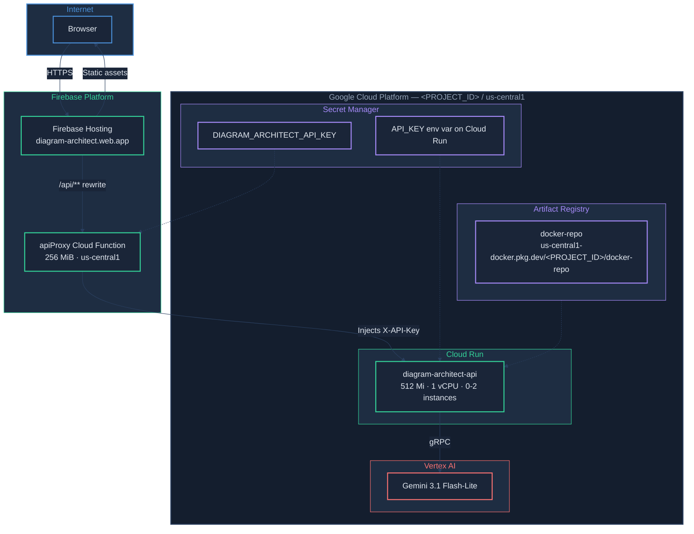

# Production Deployment -- Diagram-as-Code Architect

How to deploy and operate the application on Google Cloud Platform.

---

## Physical Architecture



### Key Connections

| From | To | Method |
|------|----|--------|
| Browser → Firebase Hosting | Static assets (HTML, JS, CSS) served from CDN |
| Firebase Hosting → Cloud Function | `/api/**` rewrite rule in `firebase.json` |
| Cloud Function → Cloud Run | HTTP proxy with `X-API-Key` header injection |
| Cloud Run → Vertex AI | Spring AI gRPC client with Application Default Credentials |
| Secret Manager → Cloud Function | `defineSecret('DIAGRAM_ARCHITECT_API_KEY')` at runtime |
| Secret Manager → Cloud Run | `API_KEY` env var mounted at container startup |

---

## GCP Resources

| Resource | Name / ID | Spec |
|----------|-----------|------|
| **Project** | `<PROJECT_ID>` | |
| **Region** | `us-central1` | All resources colocated |
| **Cloud Run service** | `diagram-architect-api` | 512 Mi, 1 vCPU, 0-2 instances, scale-to-zero |
| **Firebase Hosting site** | `diagram-architect` | CDN-backed, `diagram-architect.web.app` |
| **Cloud Function** | `apiProxy` | 256 MiB, us-central1, 120s timeout |
| **Artifact Registry** | `docker-repo` | Docker format, `us-central1` |
| **Service account** | Cloud Run default SA | `Vertex AI User` role |
| **Secrets** | `DIAGRAM_ARCHITECT_API_KEY` | API key for backend authentication |

### Service Account IAM Roles

| Role | Purpose |
|------|---------|
| `roles/aiplatform.user` | Call Vertex AI Gemini chat model |
| `roles/secretmanager.secretAccessor` | Read API key secret (bound per-secret) |

---

## Cloud Run Configuration

### Environment Variables

| Variable | Value | Source |
|----------|-------|--------|
| `SPRING_PROFILES_ACTIVE` | `prod` | Set in container image by Jib |
| `GCP_PROJECT_ID` | `<PROJECT_ID>` | Env var |
| `GCP_LOCATION` | `us-central1` | Env var |
| `API_KEY` | *(from Secret Manager)* | Secret: `DIAGRAM_ARCHITECT_API_KEY:latest` |

### Resource Limits

| Setting | Value | Rationale |
|---------|-------|-----------|
| Memory | 512 Mi | Sufficient for Spring Boot + prompt assembly |
| CPU | 1 vCPU | Single-core is adequate for this workload |
| Min instances | 0 | Scale to zero when idle (cost savings) |
| Max instances | 2 | Cap to prevent runaway costs |
| Timeout | 300s | LLM calls can take several seconds |
| JVM flags | `-Xms256m -Xmx512m` | Configured in Jib container config |

### Firebase Function Configuration

| Setting | Value |
|---------|-------|
| Runtime | Node.js (Firebase Functions v2) |
| Memory | 256 MiB |
| Region | `us-central1` |
| Timeout | 120s |
| Secrets | `DIAGRAM_ARCHITECT_API_KEY` |
| Target | Cloud Run service URL (via `API_TARGET` param) |

---

## Build & Deploy

### Prerequisites

- `gcloud` CLI authenticated with access to `<PROJECT_ID>`
- `firebase` CLI authenticated (`firebase login`)
- Docker credential helper configured: `gcloud auth configure-docker us-central1-docker.pkg.dev`
- Java 21 (for Gradle build)
- Node 20+ (for Firebase Functions)

### Environment Variables Setup

Before deploying, set up your environment variables:

```bash
cp .env.example .env
# Edit .env with your real values:
#   GCP_PROJECT_ID=your-gcp-project-id
#   CLOUD_RUN_URL=https://your-cloud-run-url
#   API_KEY=your-api-key
```

Replace `<PROJECT_ID>` in all commands below with your `GCP_PROJECT_ID` value.

### Build and Push Backend Container Image

```bash
cd backend
./gradlew jib
```

This uses the Jib Gradle plugin to build an optimized layered image and push it directly to Artifact Registry -- no Docker daemon required.

Image: `us-central1-docker.pkg.dev/<PROJECT_ID>/docker-repo/diagram-architect-api`

### Deploy Backend to Cloud Run

```bash
gcloud run deploy diagram-architect-api \
  --image=us-central1-docker.pkg.dev/<PROJECT_ID>/docker-repo/diagram-architect-api:latest \
  --region=us-central1 \
  --platform=managed \
  --set-env-vars="GCP_PROJECT_ID=<PROJECT_ID>" \
  --set-env-vars="GCP_LOCATION=us-central1" \
  --set-secrets="API_KEY=DIAGRAM_ARCHITECT_API_KEY:latest" \
  --port=8080 \
  --memory=512Mi \
  --cpu=1 \
  --min-instances=0 \
  --max-instances=2 \
  --timeout=300 \
  --allow-unauthenticated \
  --project=<PROJECT_ID>
```

### Quick Redeploy (code changes only)

```bash
cd backend
./gradlew jib && gcloud run deploy diagram-architect-api \
  --image=us-central1-docker.pkg.dev/<PROJECT_ID>/docker-repo/diagram-architect-api:latest \
  --region=us-central1 \
  --project=<PROJECT_ID>
```

### Build and Deploy Frontend

```bash
cd frontend
npm run build
firebase deploy --only hosting
```

### Deploy Firebase Function Proxy

```bash
cd functions
npm install
firebase deploy --only functions
```

### Deploy Everything

```bash
# Backend
cd backend && ./gradlew jib
gcloud run deploy diagram-architect-api \
  --image=us-central1-docker.pkg.dev/<PROJECT_ID>/docker-repo/diagram-architect-api:latest \
  --region=us-central1 --project=<PROJECT_ID>

# Frontend + Functions
cd ..
cd frontend && npm run build && cd ..
firebase deploy
```

---

## Verification

### Health Check (no auth required)

```bash
curl -s https://<CLOUD_RUN_URL>/api/v1/health
```

Expected:

```json
{
  "status": "UP",
  "components": {
    "chatModel": {
      "status": "UP",
      "details": {
        "model": "gemini-3.1-flash-lite-preview",
        "provider": "vertexai"
      }
    }
  }
}
```

### List Diagram Types (requires API key)

```bash
curl -s -H "X-API-Key: <key>" \
  https://<CLOUD_RUN_URL>/api/v1/diagrams/types
```

### Generate a Diagram via Frontend

1. Open https://diagram-architect.web.app/
2. Paste Java or Terraform code
3. Select a diagram type and click "Generate"
4. Verify the Mermaid diagram renders in the output area

### View Logs

```bash
# Recent logs
gcloud run services logs read diagram-architect-api --region=us-central1 --limit=50

# Stream logs in real time
gcloud run services logs tail diagram-architect-api --region=us-central1
```

---

## Troubleshooting

| Symptom | Cause | Fix |
|---------|-------|-----|
| Frontend shows "Failed to fetch" | Cloud Function not deployed or `firebase.json` missing `/api/**` rewrite | Run `firebase deploy --only functions` and verify `firebase.json` rewrites |
| 401 from Cloud Run | API key mismatch between function and backend | Verify `DIAGRAM_ARCHITECT_API_KEY` secret matches `API_KEY` env var on Cloud Run |
| 502 from Cloud Function | Cloud Run service not running or wrong `API_TARGET` | Check Cloud Run logs; verify `functions/.env` has correct target URL |
| Cold start takes 15-20s | Spring Boot JVM startup on Cloud Run with `min-instances=0` | Set `--min-instances=1` for ~$15-25/mo to keep warm |
| LLM_ERROR on generate | Vertex AI Gemini service issue or rate limit | Check Cloud Run logs for gRPC error details; retry after backoff |
| CORS errors in browser | Allowed origins mismatch in `application-prod.yml` | Verify `cors.allowed-origins` includes `https://diagram-architect.web.app` |
| Function deploy fails | Missing secret in Secret Manager | Create secret: `echo -n "<key>" \| gcloud secrets create DIAGRAM_ARCHITECT_API_KEY --data-file=-` |

### Secret Rotation

To rotate the API key:

```bash
# Add a new version
echo -n "<NEW_KEY>" | gcloud secrets versions add DIAGRAM_ARCHITECT_API_KEY --data-file=-

# Redeploy to pick up the new version
gcloud run deploy diagram-architect-api \
  --image=us-central1-docker.pkg.dev/<PROJECT_ID>/docker-repo/diagram-architect-api:latest \
  --region=us-central1

firebase deploy --only functions
```
