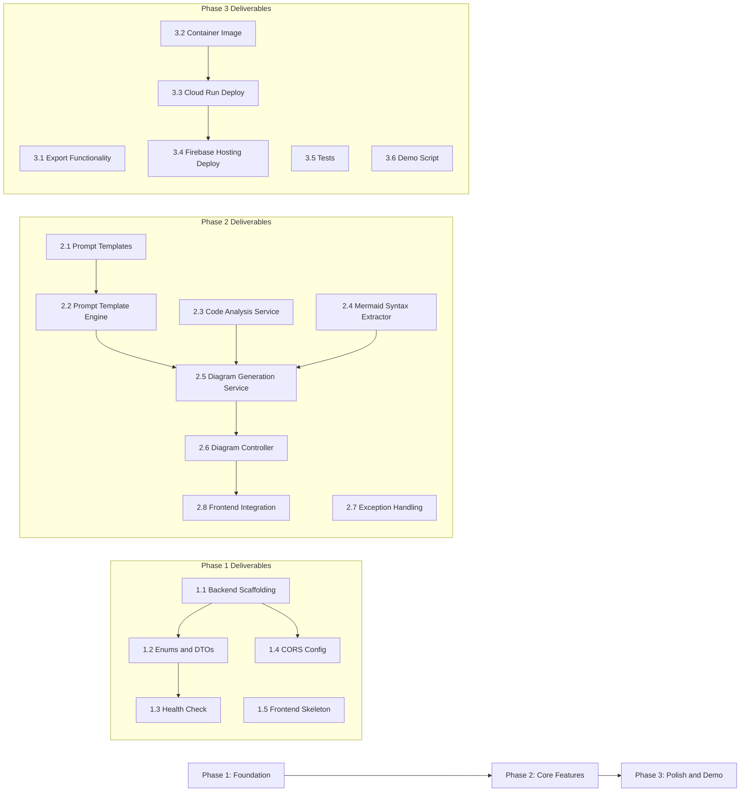

# Milestones -- Diagram-as-Code Architect

This document defines three development phases with concrete deliverables and acceptance criteria. Each phase builds on the previous one. An AI agent or developer should be able to execute against these milestones using the companion documents (architecture.md and api-contracts.md) as references.

---

## Phase 1: Foundation

**Goal:** Project scaffolding, core dependencies wired, prompt templates drafted, and a deployable (but non-functional) backend and frontend skeleton running locally.

**Estimated Effort:** 1-2 days

### Deliverables

#### 1.1 Backend Project Scaffolding

- [ ] Initialize a Spring Boot 3.4.5 project using Gradle (Kotlin DSL) with Java 21.
- [ ] Configure the following dependencies in `build.gradle.kts`:
  - `spring-boot-starter-web`
  - `spring-boot-starter-validation`
  - `spring-boot-starter-actuator`
  - `spring-ai-vertex-ai-gemini-spring-boot-starter` (1.0.1)
  - Test dependencies: `spring-boot-starter-test`
- [ ] Create the package structure as defined in architecture.md under `backend/src/main/java/com/jkingai/diagramarchitect/`.
- [ ] Configure `application.yml` with profiles for `local` and `prod`.
- [ ] In `application.yml`, configure Spring AI Vertex AI properties:
  - `spring.ai.vertex.ai.gemini.project-id` (from environment variable)
  - `spring.ai.vertex.ai.gemini.location` (default: `us-central1`)
  - `spring.ai.vertex.ai.gemini.chat.options.model` (default: `gemini-2.5-flash`)
  - `spring.ai.vertex.ai.gemini.chat.options.temperature` (default: `0.2` for deterministic structured output)

**Acceptance Criteria:**
- `./gradlew build` completes successfully (compilation, no test failures).
- The application starts locally with `./gradlew bootRun` using the `local` profile.

#### 1.2 Model Enums and DTOs

- [ ] Create `DiagramType` enum with values: `FLOWCHART`, `SEQUENCE`, `CLASS`, `ENTITY_RELATIONSHIP`, `INFRASTRUCTURE`.
- [ ] Create `CodeLanguage` enum with values: `JAVA`, `HCL`.
- [ ] Add a method to `DiagramType` that returns the set of supported `CodeLanguage` values for that type (matching the compatibility table in api-contracts.md).
- [ ] Create `DiagramRequest` record with fields: `code`, `diagramType`, `codeLanguage`, `context`. Add Bean Validation annotations: `@NotBlank` on `code`, `@NotNull` on `diagramType` and `codeLanguage`, `@Size(max = 50000)` on `code`, `@Size(max = 500)` on `context`.
- [ ] Create `DiagramResponse` record with fields: `mermaidSyntax`, `diagramType`, `codeLanguage`, `metadata`.
- [ ] Create `DiagramTypeInfo` record with fields: `type`, `name`, `description`, `supportedLanguages`, `mermaidDirective`.
- [ ] Create `ErrorResponse` record with fields: `error`, `message`, `timestamp`, `path`.

**Acceptance Criteria:**
- All DTOs compile and have proper validation annotations.
- `DiagramType.SEQUENCE.getSupportedLanguages()` returns `[JAVA]`.
- `DiagramType.FLOWCHART.getSupportedLanguages()` returns `[JAVA, HCL]`.
- `DiagramType.INFRASTRUCTURE.getSupportedLanguages()` returns `[HCL]`.

#### 1.3 Health Check Endpoint

- [ ] Implement `GET /api/v1/health` as specified in api-contracts.md.
- [ ] The endpoint checks Vertex AI availability by making a lightweight test call (or returning `UNKNOWN` if the model is not yet configured).
- [ ] Return the response structure matching api-contracts.md.

**Acceptance Criteria:**
- `curl http://localhost:8080/api/v1/health` returns a 200 response with the expected JSON structure.

#### 1.4 CORS Configuration

- [ ] Create `CorsConfig.java` that allows requests from `http://localhost:5000` (Firebase local emulator) and the production Firebase Hosting domain.
- [ ] Configure allowed methods: `GET`, `POST`, `OPTIONS`.
- [ ] Configure allowed headers: `Content-Type`.

**Acceptance Criteria:**
- A preflight `OPTIONS` request from `http://localhost:5000` returns appropriate CORS headers.

#### 1.5 Frontend Skeleton

- [ ] Create `frontend/index.html` with a single-page layout containing: a code input textarea, a diagram type dropdown selector, a code language dropdown selector, an optional context input field, a "Generate" button, a diagram output area, and buttons for "Copy Mermaid", "Export PNG", and "Export SVG".
- [ ] Create `frontend/css/style.css` with a dark theme matching the portfolio site aesthetic.
- [ ] Create `frontend/js/app.js` with event listeners wired to the UI elements (generation logic will be stubbed).
- [ ] Create `frontend/js/api.js` with functions `generateDiagram(request)` and `getDiagramTypes()` that call the backend API (hardcode base URL for now).
- [ ] Create `frontend/js/renderer.js` that initializes Mermaid.js (loaded from CDN: `https://cdn.jsdelivr.net/npm/mermaid@11.6.0/dist/mermaid.min.js`) and provides a `renderDiagram(mermaidSyntax, targetElement)` function.
- [ ] Create `frontend/firebase.json` with hosting configuration pointing to the `frontend/` directory as the public folder.

**Acceptance Criteria:**
- Opening `frontend/index.html` in a browser shows the full UI layout.
- The diagram type dropdown is populated with all five types.
- Mermaid.js loads from CDN without errors (check browser console).
- Hardcoding a sample Mermaid string in `renderer.js` produces a visible diagram.

---

**Phase 1 Dependencies:** None. This is the starting phase.

---

## Phase 2: Core Features

**Goal:** End-to-end diagram generation working -- user submits code, backend processes it through the LLM, and the frontend renders the resulting Mermaid diagram.

**Estimated Effort:** 2-4 days

**Depends on:** Phase 1 complete (scaffolding, DTOs, health check, frontend skeleton).

### Deliverables

#### 2.1 Prompt Templates

- [ ] Create prompt template files in `backend/src/main/resources/` (or `src/main/java/.../prompt/templates/` as classpath resources):
  - `java-flowchart.txt`
  - `java-sequence.txt`
  - `java-class.txt`
  - `java-entity-relationship.txt`
  - `hcl-flowchart.txt`
  - `hcl-infrastructure.txt`
- [ ] Each template must include:
  - A system instruction explaining the task (e.g., "You are an expert software architect. Analyze the following Java code and produce a Mermaid.js flowchart.").
  - Explicit Mermaid syntax rules for the target diagram type (e.g., "Use `flowchart TB` for top-to-bottom layout. Wrap node labels containing special characters in double quotes.").
  - A one-shot example of valid input and valid Mermaid output.
  - A placeholder `{code}` for the user's code and `{context}` for the optional context.
  - An instruction to output ONLY the Mermaid code block, with no surrounding explanation.
- [ ] Validate each template by manually testing it against the Gemini model (or running the integration test in 2.5).

**Acceptance Criteria:**
- Six prompt template files exist and contain all required sections.
- Each template, when filled with the sample code from api-contracts.md, produces a valid prompt string.

#### 2.2 Prompt Template Engine

- [ ] Implement `PromptTemplateEngine.java` that:
  - Loads prompt templates from the classpath.
  - Selects the correct template based on `CodeLanguage` and `DiagramType`.
  - Replaces `{code}` and `{context}` placeholders with actual values.
  - Returns the assembled prompt string.
- [ ] If `context` is null or blank, replace `{context}` with an empty string or a default instruction.

**Acceptance Criteria:**
- Unit test: given `JAVA` and `FLOWCHART`, the engine returns a prompt containing the java-flowchart template content with placeholders filled.
- Unit test: given `HCL` and `SEQUENCE`, the engine throws `UnsupportedDiagramTypeException`.

#### 2.3 Code Analysis Service

- [ ] Implement `CodeAnalysisService.java` that:
  - Validates code is not blank and does not exceed 50,000 characters.
  - Validates the `DiagramType` and `CodeLanguage` combination is supported.
  - Trims and normalizes whitespace in the code input.
- [ ] Throw `UnsupportedDiagramTypeException` for invalid combinations.

**Acceptance Criteria:**
- Unit test: blank code input throws a validation exception.
- Unit test: code exceeding 50,000 characters throws a validation exception.
- Unit test: `SEQUENCE` with `HCL` throws `UnsupportedDiagramTypeException`.
- Unit test: `FLOWCHART` with `JAVA` passes validation.

#### 2.4 Mermaid Syntax Extractor

- [ ] Implement `MermaidSyntaxExtractor.java` that:
  - Parses the LLM response text to extract the Mermaid code block.
  - Handles responses wrapped in triple backticks (` ```mermaid ... ``` `) or returned as raw Mermaid syntax.
  - Strips any leading/trailing whitespace or markdown formatting.
  - Performs basic validation: ensures the extracted syntax starts with a valid Mermaid directive (`flowchart`, `sequenceDiagram`, `classDiagram`, `erDiagram`).
- [ ] Throw `DiagramGenerationException` if no valid Mermaid syntax can be extracted.

**Acceptance Criteria:**
- Unit test: extracts Mermaid from ` ```mermaid\nflowchart TB\n...\n``` `.
- Unit test: extracts Mermaid from raw `flowchart TB\n...` without backticks.
- Unit test: throws exception for a response with no valid Mermaid content.

#### 2.5 Diagram Generation Service

- [ ] Implement `DiagramGenerationService.java` that orchestrates the full flow:
  1. Calls `CodeAnalysisService` to validate the input.
  2. Calls `PromptTemplateEngine` to assemble the prompt.
  3. Sends the prompt to Vertex AI Gemini via Spring AI's `ChatClient`.
  4. Calls `MermaidSyntaxExtractor` to parse the response.
  5. Returns a `DiagramResponse` with the Mermaid syntax and metadata (model name, input character count, processing time).
- [ ] Configure the `ChatClient` bean in `AiConfig.java` using Spring AI auto-configuration for Vertex AI Gemini.
- [ ] Set the temperature to `0.2` for consistent, deterministic output.

**Acceptance Criteria:**
- Integration test (with real or mocked LLM): submitting the sample OrderController code from api-contracts.md with `FLOWCHART`/`JAVA` returns a `DiagramResponse` containing valid Mermaid syntax starting with `flowchart`.
- The `metadata.processingTimeMs` field reflects actual elapsed time.
- The `metadata.model` field is `gemini-2.5-flash`.

#### 2.6 Diagram Controller

- [ ] Implement `DiagramController.java` with:
  - `POST /api/v1/diagrams/generate` -- accepts `DiagramRequest`, calls `DiagramGenerationService`, returns `DiagramResponse`.
  - `GET /api/v1/diagrams/types` -- returns the list of all supported diagram types as specified in api-contracts.md.
- [ ] Add `@Valid` annotation on the `@RequestBody DiagramRequest` parameter.

**Acceptance Criteria:**
- `POST /api/v1/diagrams/generate` with valid input returns 200 with a `DiagramResponse`.
- `POST /api/v1/diagrams/generate` with missing `code` returns 400 `VALIDATION_ERROR`.
- `GET /api/v1/diagrams/types` returns all five diagram types with correct metadata.

#### 2.7 Global Exception Handling

- [ ] Implement `GlobalExceptionHandler` using `@ControllerAdvice`.
- [ ] Map `UnsupportedDiagramTypeException` to 400 with `UNSUPPORTED_DIAGRAM_TYPE`.
- [ ] Map `DiagramGenerationException` to 500 with `GENERATION_FAILED`.
- [ ] Map `MethodArgumentNotValidException` to 400 with `VALIDATION_ERROR`.
- [ ] Map Spring AI client exceptions (upstream LLM errors) to 502 with `LLM_ERROR`.
- [ ] Map generic exceptions to 500 with a safe message (no stack traces in the response).
- [ ] All error responses follow the standard format from api-contracts.md.

**Acceptance Criteria:**
- Invalid requests return properly formatted error JSON matching the error response schema.
- LLM failures return 502 with `LLM_ERROR`.
- Exceptions during generation return 500 with a safe message; full details are logged server-side.

#### 2.8 Frontend Integration

- [ ] Wire `frontend/js/api.js` to call the backend endpoints:
  - `generateDiagram(request)` calls `POST /api/v1/diagrams/generate`.
  - `getDiagramTypes()` calls `GET /api/v1/diagrams/types` and populates the dropdown on page load.
- [ ] In `frontend/js/app.js`:
  - On "Generate" button click: collect form values, call `generateDiagram`, pass the response's `mermaidSyntax` to the renderer.
  - Show a loading spinner while the request is in flight.
  - Display error messages from the API in a visible error banner.
  - Filter the diagram type dropdown based on the selected code language (e.g., selecting `HCL` hides `SEQUENCE`, `CLASS`, `ENTITY_RELATIONSHIP`).
- [ ] In `frontend/js/renderer.js`:
  - Call `mermaid.render()` with the returned syntax and insert the SVG into the output area.
  - If rendering fails (invalid Mermaid syntax), display the raw syntax with an error message.

**Acceptance Criteria:**
- User can paste Java code, select `FLOWCHART`, click "Generate", and see a rendered diagram.
- User can paste Terraform code, select `INFRASTRUCTURE`, click "Generate", and see a rendered diagram.
- Selecting `HCL` as the code language filters out Java-only diagram types from the dropdown.
- API errors display a visible error message in the UI.

---

## Phase 3: Polish and Demo

**Goal:** Export functionality, production deployment, and a working demo.

**Estimated Effort:** 1-2 days

**Depends on:** Phase 2 complete (end-to-end diagram generation and rendering working).

### Deliverables

#### 3.1 Export Functionality

- [ ] Implement `frontend/js/exporter.js` with:
  - `copyMermaidSyntax(syntax)` -- copies the raw Mermaid text to the clipboard.
  - `exportAsPng(svgElement)` -- converts the rendered SVG to a PNG and triggers a download.
  - `exportAsSvg(svgElement)` -- extracts the SVG markup and triggers a download.
- [ ] Wire the "Copy Mermaid", "Export PNG", and "Export SVG" buttons to these functions.

**Acceptance Criteria:**
- Clicking "Copy Mermaid" copies the syntax to the clipboard (verified by pasting).
- Clicking "Export PNG" downloads a PNG file of the diagram.
- Clicking "Export SVG" downloads an SVG file of the diagram.

#### 3.2 Container Image with Jib

- [ ] Add the Jib Gradle plugin to the backend `build.gradle.kts`.
- [ ] Configure the image to use `eclipse-temurin:21-jre` as the base image.
- [ ] Configure the image name to target Artifact Registry: `{region}-docker.pkg.dev/{project-id}/diagram-architect/api`.
- [ ] Verify the image builds and runs locally: `./gradlew jibDockerBuild && docker run -p 8080:8080 ...`.

**Acceptance Criteria:**
- `./gradlew jibDockerBuild` produces a local Docker image.
- The image starts and the health endpoint responds.

#### 3.3 Cloud Run Deployment

- [ ] Create a deployment script or `service.yaml` for deploying the backend to Cloud Run.
- [ ] Configure environment variables for the `prod` profile: GCP project ID, Vertex AI region.
- [ ] Configure the service with: 512 MiB memory (lightweight, no heavy processing), request timeout of 60 seconds, concurrency of 80, min instances of 0 (scale to zero), max instances of 2 (portfolio project, limit costs).
- [ ] Ensure the Cloud Run service account has the `Vertex AI User` IAM role.

**Acceptance Criteria:**
- The backend deploys to Cloud Run and starts successfully.
- `curl https://{cloud-run-url}/api/v1/health` returns `status: UP`.
- `curl https://{cloud-run-url}/api/v1/diagrams/types` returns the diagram types list.

#### 3.4 Firebase Hosting Deployment

- [ ] Configure `frontend/firebase.json` to:
  - Set the public directory to the frontend root.
  - Add a rewrite rule so all paths serve `index.html`.
  - Configure cache headers for static assets (CSS, JS).
- [ ] Update `frontend/js/api.js` to use the production Cloud Run URL (read from a configuration or environment-based constant).
- [ ] Deploy with `firebase deploy --only hosting`.

**Acceptance Criteria:**
- The frontend is accessible at the Firebase Hosting URL.
- The frontend successfully calls the Cloud Run backend and renders diagrams.

#### 3.5 Unit and Integration Tests

- [ ] Write unit tests for all services:
  - `CodeAnalysisServiceTest` -- validation logic.
  - `PromptTemplateEngineTest` -- template selection and placeholder replacement.
  - `MermaidSyntaxExtractorTest` -- extraction from various LLM response formats.
  - `DiagramGenerationServiceTest` -- orchestration with mocked dependencies.
- [ ] Write controller tests:
  - `DiagramControllerTest` -- endpoint behavior with mocked `DiagramGenerationService`.
- [ ] Write one integration test:
  - `DiagramGenerationIntegrationTest` -- end-to-end with a mocked ChatClient that returns a canned Mermaid response. Verifies the full request/response cycle through the controller.
- [ ] Add sample test resources:
  - `sample-spring-boot-code.java` -- sample Java input.
  - `sample-terraform.tf` -- sample Terraform input.
  - `expected-flowchart.mmd` -- expected Mermaid output for validation.

**Acceptance Criteria:**
- `./gradlew test` passes with all tests green.
- Tests do not require external GCP credentials (the ChatClient is mocked).

#### 3.6 Demo Script and Sample Data

- [ ] Create a `demo/` directory in the project root with:
  - `sample-order-service.java` -- a multi-class Spring Boot code sample (the OrderController example from api-contracts.md).
  - `sample-infrastructure.tf` -- a Terraform configuration sample (the VPC/GKE example from api-contracts.md).
  - `demo.sh` -- a shell script that:
    1. Checks that the backend is running (calls health endpoint).
    2. Generates a flowchart from the Java sample.
    3. Generates a sequence diagram from the Java sample.
    4. Generates a class diagram from the Java sample.
    5. Generates an infrastructure diagram from the Terraform sample.
    6. Prints each Mermaid output with a header.
- [ ] The demo script should use `curl` and `jq` for readable output.

**Acceptance Criteria:**
- Running `./demo/demo.sh` against a running backend instance completes without errors.
- Each request returns valid Mermaid syntax.
- The demo takes under 1 minute to run end-to-end.

---

## Milestone Dependency Graph



---

## Summary Table

| Phase | Deliverables | Depends On | Effort |
|-------|-------------|------------|--------|
| Phase 1: Foundation | Backend scaffolding, enums/DTOs, health check, CORS config, frontend skeleton | None | 1-2 days |
| Phase 2: Core Features | Prompt templates, template engine, code analysis, Mermaid extractor, generation service, controller, error handling, frontend integration | Phase 1 | 2-4 days |
| Phase 3: Polish and Demo | Export functionality, container image, Cloud Run deploy, Firebase Hosting deploy, tests, demo script | Phase 2 | 1-2 days |
| **Total** | **20 deliverables** | | **4-8 days** |
